# AI Pulse for macOS

**你的 AI 编程花费追踪仪。** 精确掌握你在 AI 编码工具（Claude Code、Cursor、Copilot、DeepSeek 等）上的花费，以及这些产出是否值得。**100% 本地运行 —— 数据绝不出设备。**

**Your AI coding cost tracker.** See exactly what you spend on AI coding tools — Claude Code, Cursor, Copilot, DeepSeek, and more — and whether the output is worth it. **100% local — zero data leaves your machine.**

## 截图（Screenshots）

### macOS

|  | 中文 | English |
|:---:|:---:|:---:|
| **仪表盘 · 今日 / Dashboard · Today** | 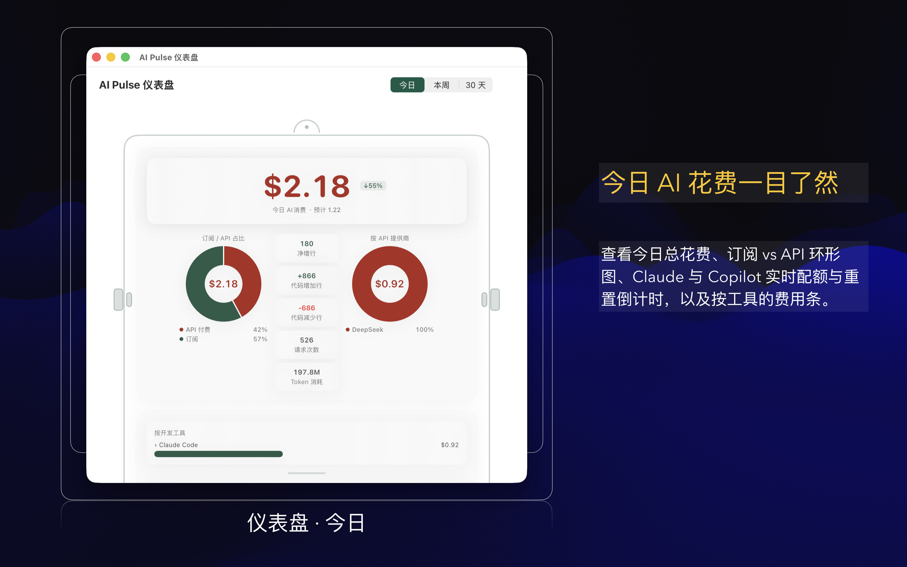 | 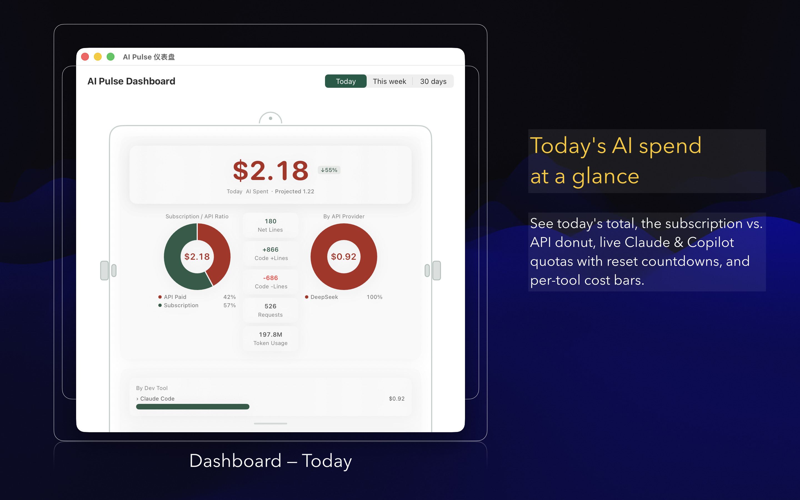 |
| **仪表盘 · 30 天 / Dashboard · 30 Days** | 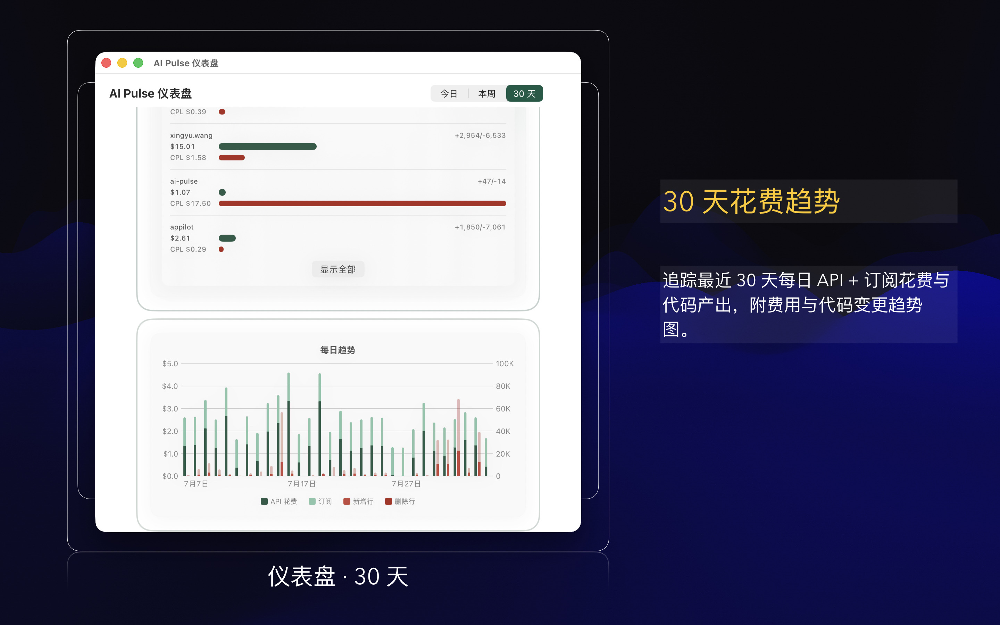 |  |
| **欢迎 · 授权 / Onboarding · Access** | 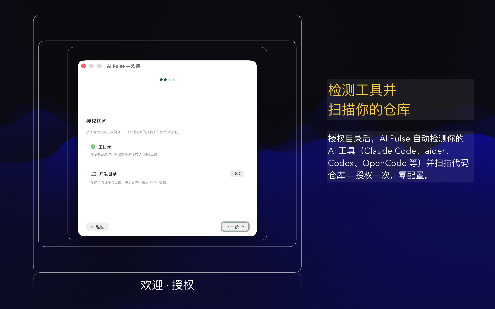 | 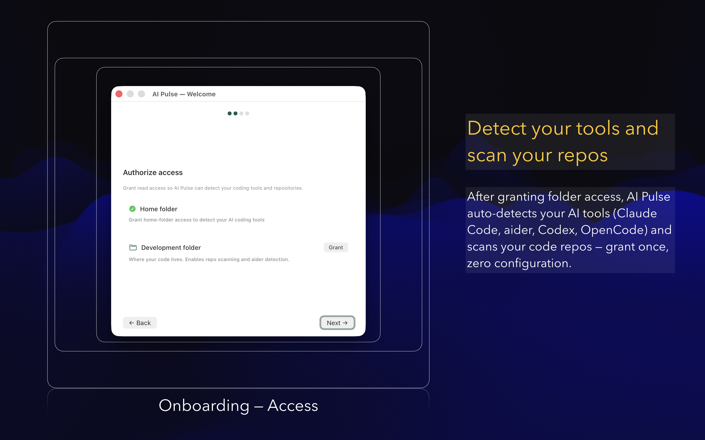 |
| **设置 · AI 服务商 / Settings · AI Providers** | 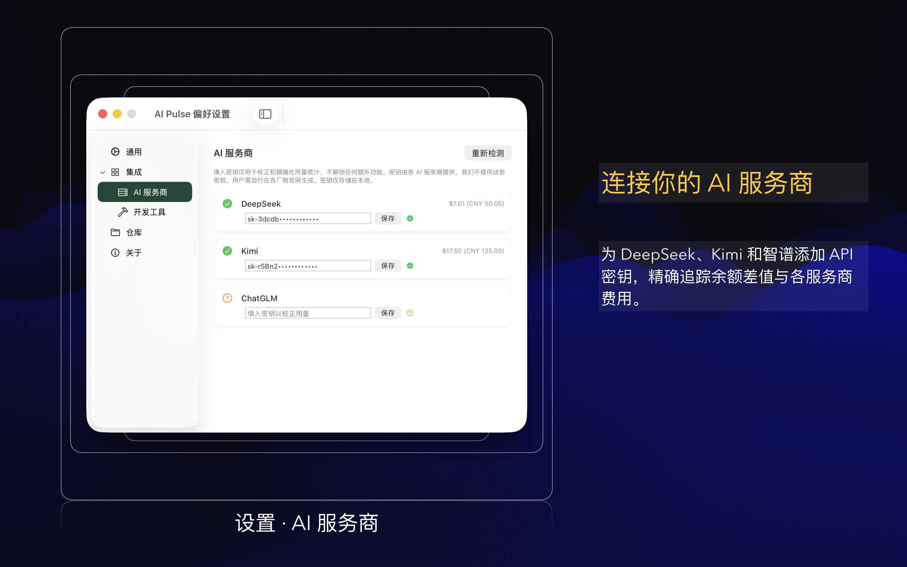 | 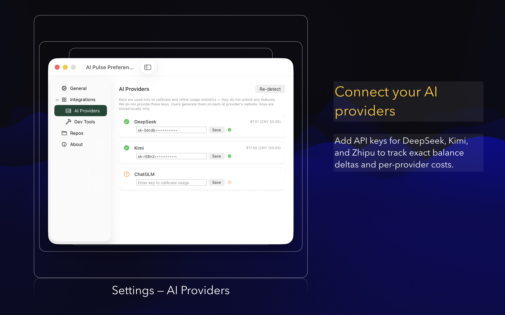 |
| **设置 · 开发工具 / Settings · Dev Tools** | 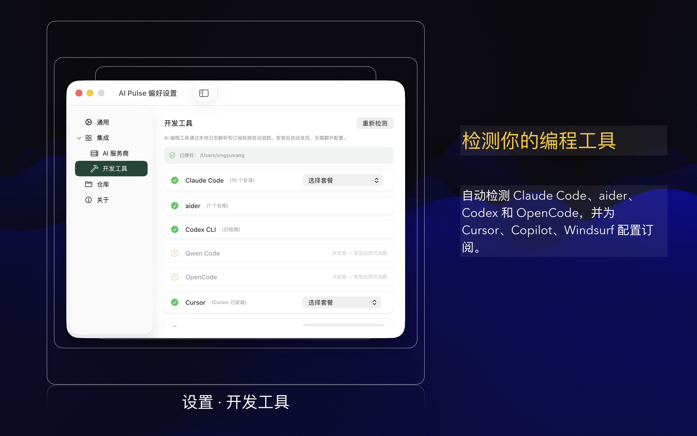 | 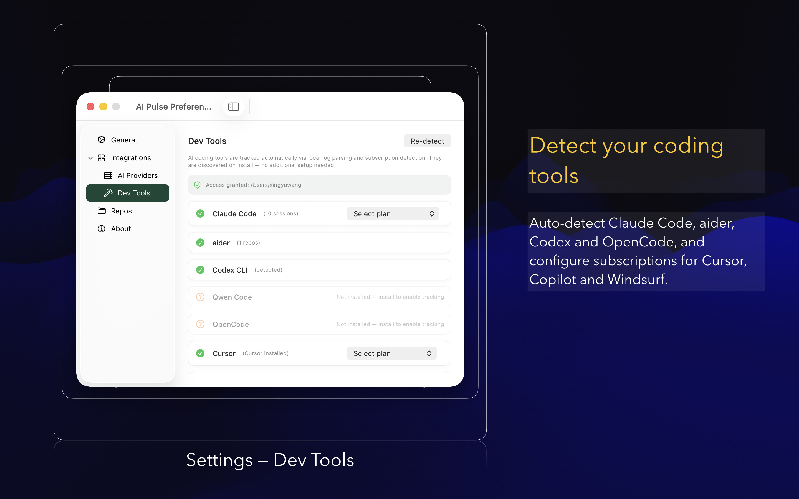 |
| **设置 · 仓库 / Settings · Repos** | 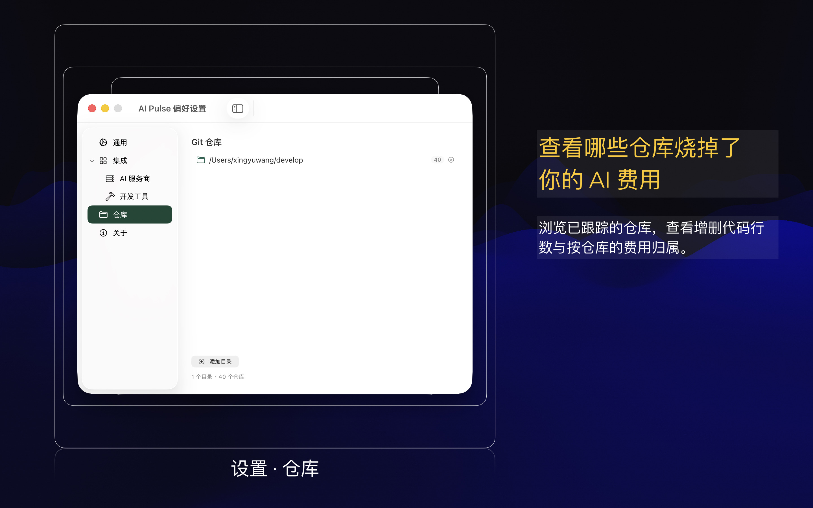 | 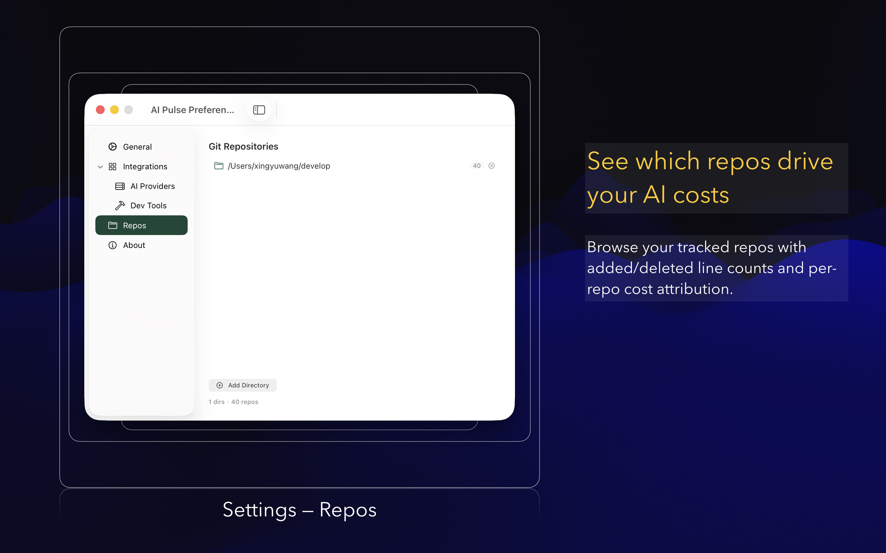 |

### iOS

|  | 中文 | English |
|:---:|:---:|:---:|
| **仪表盘 · 今日 / Dashboard · Today** | 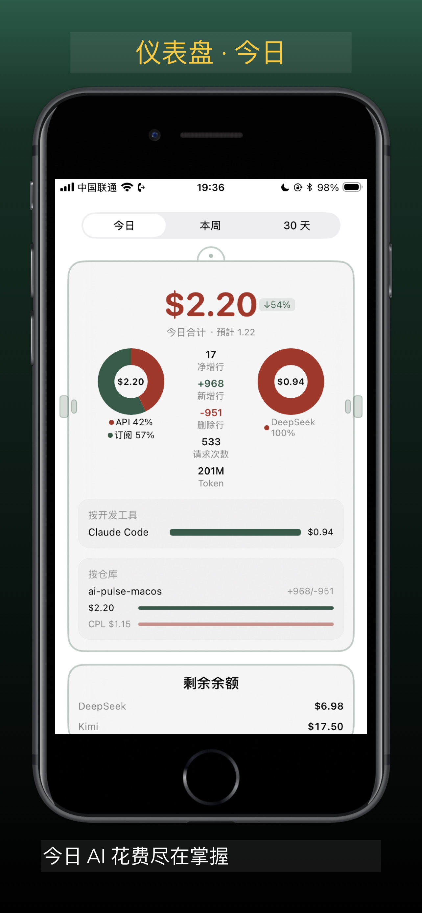 | 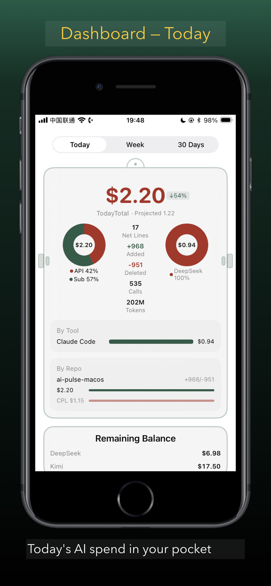 |
| **仪表盘 · 30 天 / Dashboard · 30 Days** |  | 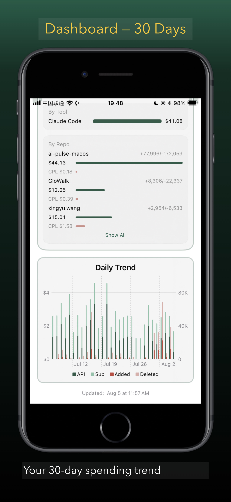 |

### watchOS

|  | 中文 | English |
|:---:|:---:|:---:|
| **首页 / Home** | 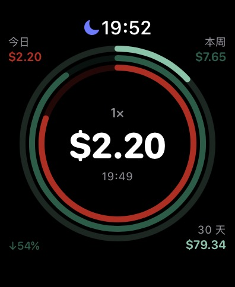 | 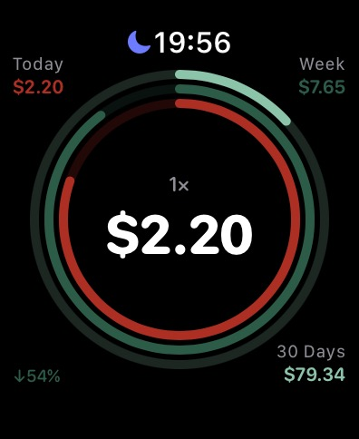 |

## 下载（Download）

- **macOS 版** — 需要 macOS 14 Sonoma 或更高版本 
  **macOS** — requires macOS 14 Sonoma or later
- **iOS 版** — 需要 iOS 16 或更高版本，以及 macOS 版作为数据来源 
  **iOS** — requires iOS 16 or later, and the macOS version as its data source

💡 **多平台通用购买（Universal Purchase）—— 一次购买，iOS 与 macOS 通用。** 如果您已经购买了 Mac 版，在 iPhone / iPad 上下载时仍看到价格按钮，请不要担心：只要使用同一个 Apple ID，直接点击购买即可，系统会自动识别您的购买记录并提示「免费下载」，绝不会向您重复扣费。

💡 **Universal Purchase — buy once, use on both platforms.** A single purchase covers iOS and macOS. If you already own the Mac version and still see a price button on your iPhone or iPad, don't worry — as long as you're signed in with the same Apple ID, the App Store will recognize your existing purchase and let you download for free. You will never be charged twice.

## 功能（Features）

### 仪表盘（Dashboard）

以机器人头像为主视觉的主窗口，一目了然： 
Your home screen — styled as a robot head — shows the full picture at a glance:

- **今日 / 本周 / 30 天** — 一键切换时间范围 
  **Today / This Week / 30 Days** — switch time ranges with one click
- **环形图** — 订阅 vs API 花费分布，外加各服务商明细 
  **Donut chart** — subscription vs. API spending split, plus a per-provider breakdown
- **趋势图** — 每日 API + 订阅花费堆叠展示（本周 / 30 天页签） 
  **Trend chart** — daily costs stacked by API + subscription (Week and 30 Days tabs)
- **工具 & 仓库排行** — 哪些 AI 工具和项目烧钱最多，含 **CPL（代码行成本）** 
  **Tool & repo ranking** — which AI tools and projects cost the most, with **Cost Per Line (CPL)**
- **实时统计** — 净增代码行、增/删行数、请求次数、Token 用量 
  **Live stats** — net lines of code, added/deleted lines, request count, and token usage
- **余额 & 额度** — 今日页签显示 API 余额与订阅用量（如 Claude、Copilot） 
  **Balances & quotas** — remaining API balance and subscription utilization (e.g. Claude, Copilot) on the Today tab

### Dock 图标（Dock）

Dock 图标是你的「活」花费仪表： 
The Dock icon is a living gauge for your spending:

- **花费进度环** — 图标周围的光环随今日花费 vs 日均费率填充 
  **Spending ring** — a progress ring around the icon fills with today's spend vs. your daily rate
- **角标** — 图标上直接显示今日总额 
  **Badge** — today's total, right on the icon
- **右键统计菜单** — 今日/本周概览，以及按工具、服务商、仓库下钻 
  **Right-click stats menu** — today/week summaries and drill-downs by tool, provider, and repo
- **金色脉冲** — 新数据到达时的一抹光晕 
  **Gold pulse** — a brief glow whenever new data arrives

### iOS 伴侣应用（iOS Companion）

只读伴侣应用，通过 iCloud 将花费镜像到你的 iPhone / iPad —— 今日、本周、30 天趋势、环形图、按仓库明细。它自身不采集、不上传任何数据，只读取 Mac 同步过来的内容。

A read-only companion that mirrors your spending to your iPhone or iPad via iCloud — today, this week, and 30-day trends, donut charts, and per-repo breakdowns. It never collects or uploads anything on its own; it only reads what your Mac has synced.

### 支持的工具（Supported Tools）

目前追踪 13 款 AI 工具，通过三种采集方式：

AI Pulse tracks 13 AI tools today across three collection methods:

| 采集方式 / Collection method | 工具 / Tools |
|---|---|
| **日志解析**（Token 级计价）/ **Log parsing** (token-level) | Claude Code、aider、Codex CLI、OpenCode、Qwen Code |
| **余额 API**（精确余额差值）/ **Balance API** (exact deltas) | DeepSeek、OpenAI、Kimi、智谱（ChatGLM）、Anthropic\* |
| **订阅检测**（月费按天摊销）/ **Subscription detection** | Cursor、GitHub Copilot、Windsurf（+ Trae、Augment Code） |

\* Anthropic 无余额 API，其用量按 Token 计价估算。 / Anthropic has no balance API, so its usage is estimated from token pricing.

## 快速上手（Getting Started）

1. **安装** — 从 Mac App Store 下载（需要 macOS 14 或更高版本）。 
   **Install** — download from the Mac App Store (requires macOS 14 or later).
2. **首次引导** — 首次启动的四步引导会检测你已安装的 AI 工具：AI 服务商、开发工具、仓库、完成。检测到的工具会自动启用。 
   **Onboarding** — on first launch, a short walkthrough detects your installed AI tools across four steps: AI providers, dev tools, repos, and a summary. Detected tools are enabled automatically.
3. **授权主目录访问** — 在沙盒环境下读取 Claude Code、Codex、OpenCode、Qwen 和 aider 的日志时，按提示允许访问主目录。 
   **Grant Home access** — to read logs from Claude Code, Codex, OpenCode, Qwen, and aider inside the sandbox, allow Home-folder access when prompted.
4. **添加 API Key** — 设置 → 集成 → **AI 服务商**。Key 仅保存在本地，并通过实时余额校验验证。 
   **Add API keys** — Settings → Integrations → **AI Providers**. Keys are stored locally and validated with a live balance check.
5. **选择订阅方案** — 设置 → 集成 → **开发工具**，选择你的订阅方案（如 Cursor Pro）。 
   **Choose plans** — Settings → Integrations → **Dev Tools** lets you pick your subscription plan (e.g. Cursor Pro).
6. **浏览仪表盘** — 在今日、本周、30 天之间切换。 
   **Explore the Dashboard** — switch between Today, This Week, and 30 Days.
7. **随时右键 Dock 图标** 查看快速统计菜单。 
   **Right-click the Dock icon** anytime for a quick stats menu.
8. **手机查看？** 使用同一 Apple ID 安装 iOS 伴侣应用 —— 花费会自动通过 iCloud 同步。 
   **On the go?** Install the iOS companion with the same Apple ID — your spending syncs automatically via iCloud.

## 数据与隐私（Data & Privacy）

- **100% 本地运行** — 一切都在你的 Mac 上处理，数据绝不出设备。 
  **100% local** — everything is processed on your Mac; no data leaves your machine.
- **API Key** 仅保存在本地，只用于查询你自己的余额。 
  **API keys** are stored locally and used only to query your own balances.
- **iOS 伴侣为只读** — 它自身不采集任何数据；iCloud 同步只发生在使用同一 Apple ID 登录的你自己的设备之间。 
  **iOS companion is read-only** — it never collects anything itself, and iCloud sync happens only between your own devices signed in with the same Apple ID.

## 环境要求（Requirements）

- macOS 14 Sonoma 或更高版本 
  macOS 14 Sonoma or later
- iOS 伴侣需要 iOS 16 或更高版本（并以 macOS 版作为数据来源） 
  The iOS companion requires iOS 16 or later (plus the macOS version as its data source)

## 相关项目（Related Projects）

- [AI Pulse Chrome 扩展](https://github.com/wxy/ai-pulse) — 覆盖网页端 AI 工具（ChatGPT、Claude.ai、DeepSeek Chat 等） 
  [AI Pulse for Chrome](https://github.com/wxy/ai-pulse) — browser extension for web-based AI tools (ChatGPT, Claude.ai, DeepSeek Chat, and more)

## 参与贡献（Contributing）

开发环境搭建、架构说明、如何新增集成，请参阅 [CONTRIBUTING.md](CONTRIBUTING.md)。

See [CONTRIBUTING.md](CONTRIBUTING.md) for development setup, architecture, and how to add new integrations.

## 许可证（License）

Apache-2.0
