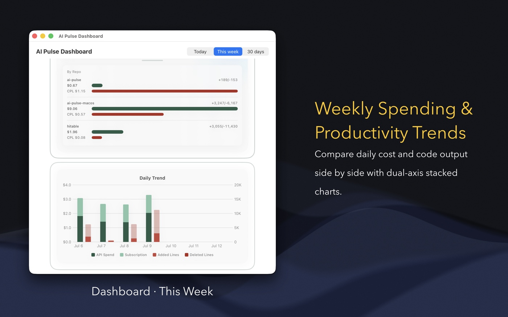
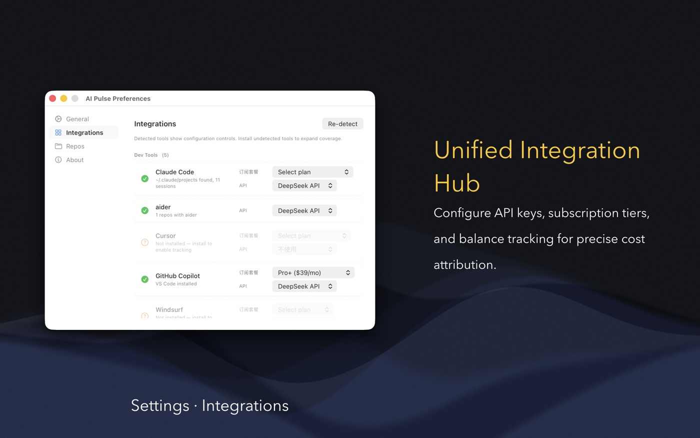

# AI Pulse for macOS

**你的 AI 编程花费追踪仪。** 精确掌握你在 AI 编码工具（Claude Code、Cursor、Copilot、DeepSeek 等）上的花费，以及这些产出是否值得。**100% 本地运行 —— 数据绝不出设备。**

## 截图

| 仪表盘 · 今日 | 仪表盘 · 本周 | 设置 |
|:---:|:---:|:---:|
|  |  |  |

## 下载

- **macOS 版** — 需要 macOS 14 Sonoma 或更高版本
- **iOS 版** — 需要 iOS 16 或更高版本，以及 macOS 版作为数据来源

💡 **多平台通用购买（Universal Purchase）—— 一次购买，iOS 与 macOS 通用。**
如果您已经购买了 Mac 版，在 iPhone / iPad 上下载时仍看到价格按钮，请不要担心：
只要使用同一个 Apple ID，直接点击购买即可，系统会自动识别您的购买记录并提示「免费下载」，
绝不会向您重复扣费。

## 功能

### 仪表盘（Dashboard）

以机器人头像为主视觉的主窗口，一目了然：

- **今日 / 本周 / 30 天** — 一键切换时间范围
- **环形图** — 订阅 vs API 花费分布，外加各服务商明细
- **趋势图** — 每日 API + 订阅花费堆叠展示（本周 / 30 天页签）
- **工具 & 仓库排行** — 哪些 AI 工具和项目烧钱最多，含 **CPL（代码行成本）**
- **实时统计** — 净增代码行、增/删行数、请求次数、Token 用量
- **余额 & 额度** — 今日页签显示 API 余额与订阅用量（如 Claude、Copilot）

### Dock 图标

Dock 图标是你的「活」花费仪表：

- **花费进度环** — 图标周围的光环随今日花费 vs 日均费率填充
- **角标** — 图标上直接显示今日总额
- **右键统计菜单** — 今日/本周概览，以及按工具、服务商、仓库下钻
- **金色脉冲** — 新数据到达时的一抹光晕

### iOS 伴侣应用

只读伴侣应用，通过 iCloud 将花费镜像到你的 iPhone / iPad —— 今日、本周、30 天趋势、
环形图、按仓库明细。它自身不采集、不上传任何数据，只读取 Mac 同步过来的内容。

| iOS 仪表盘 · 今日 | iOS 仪表盘 · 30 天 |
|:---:|:---:|
|  |  |

### 支持的工具

目前追踪 13 款 AI 工具，通过三种采集方式：

| 采集方式 | 工具 |
|---|---|
| **日志解析**（Token 级计价） | Claude Code、aider、Codex CLI、OpenCode、Qwen Code |
| **余额 API**（精确余额差值） | DeepSeek、OpenAI、Kimi、智谱（ChatGLM）、Anthropic\* |
| **订阅检测**（月费按天摊销） | Cursor、GitHub Copilot、Windsurf（+ Trae、Augment Code） |

\* Anthropic 无余额 API，其用量按 Token 计价估算。

## 快速上手

1. **安装** — 从 Mac App Store 下载（需要 macOS 14 或更高版本）。
2. **首次引导** — 首次启动的四步引导会检测你已安装的 AI 工具：AI 服务商、开发工具、
   仓库、完成。检测到的工具会自动启用。
3. **授权主目录访问** — 在沙盒环境下读取 Claude Code、Codex、OpenCode、Qwen 和 aider
   的日志时，按提示允许访问主目录。
4. **添加 API Key** — 设置 → 集成 → **AI 服务商**。Key 仅保存在本地，并通过实时余额校验验证。
5. **选择订阅方案** — 设置 → 集成 → **开发工具**，选择你的订阅方案（如 Cursor Pro）与首选 API Key。
6. **浏览仪表盘** — 在今日、本周、30 天之间切换。
7. **随时右键 Dock 图标** 查看快速统计菜单。
8. **手机查看？** 使用同一 Apple ID 安装 iOS 伴侣应用 —— 花费会自动通过 iCloud 同步。

## 数据与隐私

- **100% 本地运行** — 一切都在你的 Mac 上处理，数据绝不出设备。
- **API Key** 仅保存在本地，只用于查询你自己的余额。
- **iOS 伴侣为只读** — 它自身不采集任何数据；iCloud 同步只发生在使用同一 Apple ID
  登录的你自己的设备之间。

## 环境要求

- macOS 14 Sonoma 或更高版本
- iOS 伴侣需要 iOS 16 或更高版本（并以 macOS 版作为数据来源）

## 相关项目

- [AI Pulse Chrome 扩展](https://github.com/wxy/ai-pulse) — 覆盖网页端 AI 工具
  （ChatGPT、Claude.ai、DeepSeek Chat 等）

## 参与贡献

开发环境搭建、架构说明、如何新增集成，请参阅 [CONTRIBUTING.md](CONTRIBUTING.md)。

## 许可证

Apache-2.0
